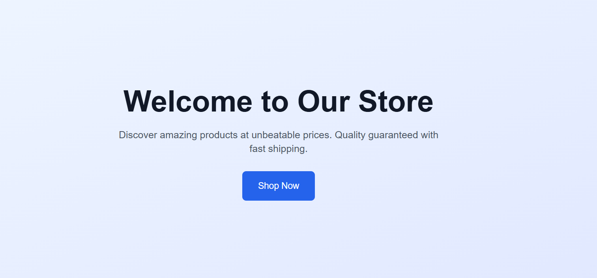

# Product Listing Interface

A modern, responsive e-commerce product listing interface built with Next.js 15, React, and Tailwind CSS. Features a clean design with smooth animations, dynamic routing, and optimized performance.


<p align="center">
  
   <p align="center">Product Listing Interface</p>
</p>


## ✨ Features

### 🛍️ Product Management
- **Product Grid**: Responsive grid layout that adapts to different screen sizes
- **Product Cards**: Interactive cards with hover effects and smooth animations
- **Product Details**: Dedicated pages for each product with comprehensive information
- **Dynamic Routing**: SEO-friendly URLs with Next.js App Router

### 📱 Responsive Design
- **Mobile-First**: Optimized for mobile devices with touch-friendly interactions
- **Tablet Support**: 2-column grid layout for medium screens
- **Desktop Optimized**: Multi-column grid (3-4 columns) for larger screens
- **Smooth Transitions**: CSS animations and hover effects throughout

### 🎨 Modern UI/UX
- **Clean Design**: Minimalist interface with consistent spacing and typography
- **Interactive Elements**: Hover effects, button animations, and micro-interactions
- **Professional Styling**: Modern card-based design with shadows and rounded corners
- **Accessibility**: Proper ARIA labels and keyboard navigation support

### ⚡ Performance
- **Next.js 15**: Latest features including App Router and Server Components
- **Image Optimization**: Automatic image optimization with Next.js Image component
- **Static Generation**: Pre-rendered pages for optimal loading speeds
- **Code Splitting**: Automatic code splitting for faster page loads

## 🛠️ Tech Stack

- **Framework**: [Next.js 15](https://nextjs.org/) with App Router
- **Language**: [TypeScript](https://www.typescriptlang.org/)
- **Styling**: [Tailwind CSS](https://tailwindcss.com/)
- **Icons**: [Lucide React](https://lucide.dev/)


## 🚀 Getting Started

### Prerequisites

- Node.js 18.0 or later
- npm, yarn, or pnpm package manager

### Installation

1. **Clone the repository**
   ```bash
   git clone https://github.com/yourusername/product-listing-interface.git
   cd product-listing-interface
   ```

2. **Install dependencies**
   ```bash
   npm install
   # or
   yarn install
   # or
   pnpm install
   ```

3. **Run the development server**
   ```bash
   npm run dev
   # or
   yarn dev
   # or
   pnpm dev
   ```

4. **Open your browser**
   Navigate to [http://localhost:3000](http://localhost:3000) to see the application.
